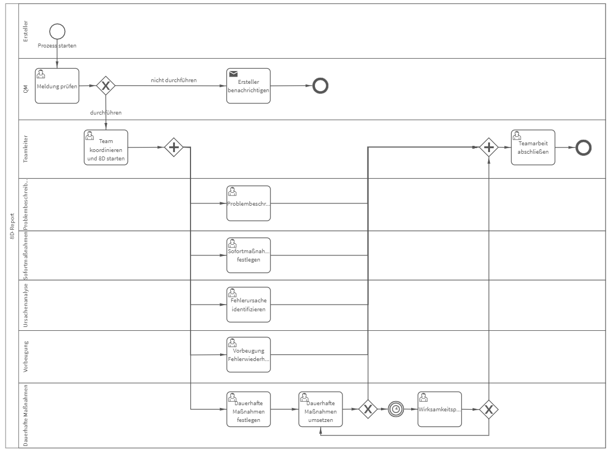

# 8D-Report
## Bild

**Rollen:** Ersteller, QM, Teamleiter, Problembeschreibung, Sofortmaßnahmen, Ursachenanalyse, Vorbeugung, Dauerhafte Maßnahmen

Der 8-D Report ist eine Standardmethode, welche einen Problemlösungsprozess festlegt, steuert und dokumentiert. Nähere Informationen zur 8D-Methode finden Sie im Blogbeitrag: [https://www.roxtra.com/blog/8-d-methode/](https://www.roxtra.com/blog/8-d-methode/)

Im vorliegenden Prozess „8D-Report“ werden die 8D’s:

- D1 Zusammenstellen eines Teams für die Problemlösung
- D2 Problembeschreibung
- D3 Sofortmaßnahmen festlegen
- D4 Fehlerursache(n) identifizieren
- D5 Planen von dauerhaften Maßnahmen
- D6 Einführen der dauerhaften Maßnahmen
- D7 Fehlerwiederholung verhindern (Vorbeugung)
- D8 Würdigen der Teamleistung

automatisiert durchlaufen. Der Prozess startet mit der Meldung eines Fehlers durch den Ersteller. Anschließend überprüft das QM die Meldung und bewertet, ob eine 8D-Methode gestartet werden soll.

Entscheidet das QM gegen die 8D-Methode, erhält der Ersteller folgende Benachrichtigung:  

_Guten Tag Vorname Nachname (Ersteller),_

_Vielen Dank für Ihre Meldung "Titel", wir werden diese allerdings nicht mittels 8D-Methode bearbeiten._

_Begründung: Begründung_

_Bitte starten Sie bei Bedarf einen anderen Prozess zur Durchführung von Korrekturen._

_Mit freundlichen Grüßen  
Vorname Nachname (QM)_

In die Benachrichtigung werden automatisch der Titel sowie die abgegebene Begründung eingefügt.

Entscheidet sich das QM für die 8D-Methode, startet der Prozess mit „D1“. Der Teamleiter koordiniert das Team und die weiteren Schritte. Im Prozess starten D2 bis D7 gleichzeitig. Diese Prozessschritte müssen alle abgeschlossen werden, bevor der Prozess mit der Würdigung der Teamleistung beendet wird. Optional kann zur Kontrolle der Wirksamkeit der entwickelten dauerhaften Maßnahmen eine Wirksamkeitsprüfung durchgeführt werden. Dies ist bei der Umsetzung der dauerhaften Maßnahmen mit einem Datum zu Wirksamkeitsprüfung zu hinterlegen.