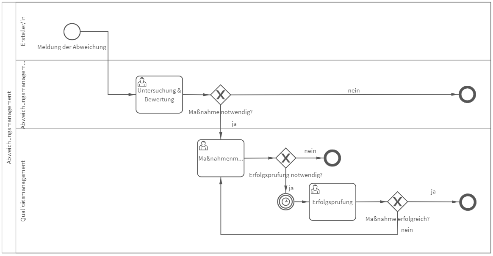

# Abweichungsmanagement
## Bild

**Rollen:** Ersteller, Abweichungsmanagement, Qualitätsmanagement

Der Prozess „Abweichungsmanagement“ beginnt mit der Meldung der Abweichung durch den Ersteller. Im Anschluss wird die Meldung zum Abweichungsmanagement (AM) zur Untersuchung und Bewertung weitergeleitet. Das AM entscheidet darüber, ob Maßnahmen notwendig sind oder nicht. 
Für das Maßnahmenmanagement ist die Abteilung Qualitätsmanagement zuständig. Sie entscheidet darüber welche Maßnahmen ergriffen werden und ob eine Erfolgsprüfung notwendig ist oder nicht.