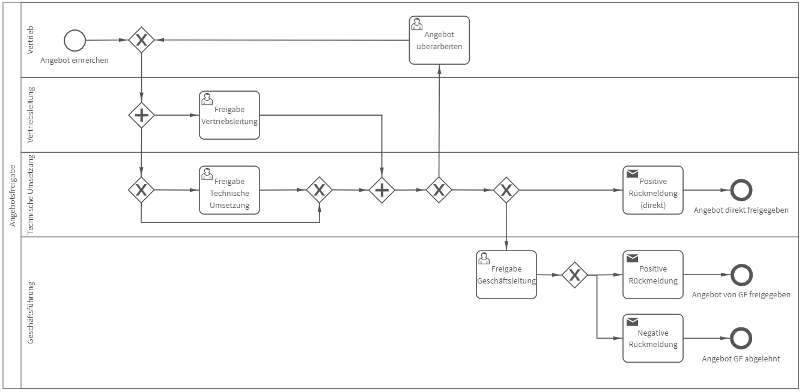

# Angebotsfreigabe
## Bild

## Beschreibung 

**Rollen:** Vertrieb, Vertriebsleitung, Technische Umsetzung, Geschäftsführung

Der Prozess „Angebotsfreigabe“ automatisiert die Freigabe von Angeboten durch die Vertriebsleitung. Zudem müssen Angebote über „non-standard“ Produkte vom Team der Technischen Umsetzung und Angebote ≥ 500.000 Euro von der Geschäftsleitung freigegeben werden.

Der Prozess beginnt mit der Einreichung des Angebots. In diesem Schritt sind u.a. die Angebotsnummer, die Produktkategorie und die Preiskategorie anzugeben. Entsprechend der hier ausgewählten Angaben (Standard- oder Non-Standardprodukt, Kosten unter oder über 500.000 Euro) verläuft der Prozess.

Im nächsten Schritt erfolgt die Freigabe durch die Vertriebsleitung. Parallel startet bei non-standard Produkten die Freigabe durch die Technischen Umsetzung. Geben Vertriebsleitung und Technischen Umsetzung das Angebot frei, ist der Prozess beendet und der Vertrieb erhält folgende Meldung:

_Das Angebot (Angebotsnummer) wurde freigegeben._

In der Benachrichtigung wird automatisch die eingangs angegebene Angebotsnummer eingetragen.

Gibt Vertriebsleitung oder Technischen Umsetzung das Angebot nicht frei, geht das Angebot zur Überarbeitung zurück an den Vertrieb. Zudem müssen Vertriebsleitung und Technischen Umsetzung, sobald „nicht freigegeben“ ausgewählt wird, einen Kommentar zur Nicht-Freigabe abgeben.

Handelt es sich um ein Angebot ≥ 500.000 Euro beinhaltet der Prozess den Prozessschritt „Freigabe durch Geschäftsleitung“. Nach Freigabe des Angebots durch Vertriebsleitung und Technischen Umsetzung erhält die Geschäftsleitung die Aufgabe zur Freigabe des Angebots. Gibt die Geschäftsleitung das Angebot frei, erhält der Vertrieb die Benachrichtigung:

_Das Angebot (Angebotsnummer) wurde von der Geschäftsleitung freigegeben._

In der Benachrichtigung wird automatisch die eingangs angegebene Angebotsnummer eingetragen.

Wird das Angebot von der Geschäftsleitung nicht freigegeben, muss ein Kommentar hierzu abgegeben werden und der Vertrieb erhält folgende Benachrichtigung:

_Das Angebot (Angebotsnummer) wurde abgelehnt.  
Hinweis der Geschäftsleitung: Kommentar Geschäftsleitung_

In der Benachrichtigung wird automatisch die eingangs angegebene Angebotsnummer sowie der Kommentar der Geschäftsleitung eingetragen.

Nach der Entscheidung der Geschäftsleitung ist der Prozess beendet.
