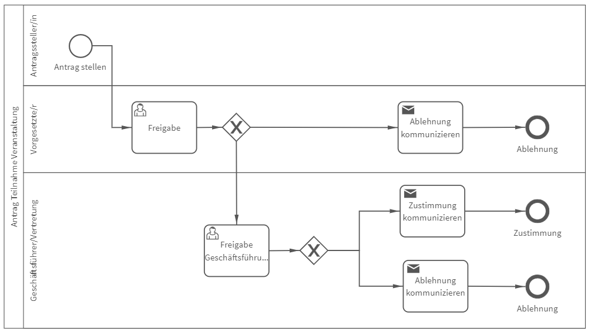

# Antrag auf Teilnahme Veranstaltung
## Bild

**Rollen:** Antragsteller/in, Vorgesetzte/r, Geschäftsführer/Vertreter

Der Prozess „Antrag auf Teilnahme Veranstaltung“ bildet eine Möglichkeit ab, die Teilnahme an einer Veranstaltung freizugeben.
Nach der Antragstellung im ersten Schritt, erhält der Vorgesetzte die Aufgabe zur Freigabe der Teilnahme. Wird die Teilnahme für sinnvoll erachtet, erhält die Geschäftsführung den Antrag ebenfalls zur Freigabe.
Die jeweiligen Entscheidungen werden dem Antragsteller automatisch mit entsprechender Begründung vom System mitgeteilt.