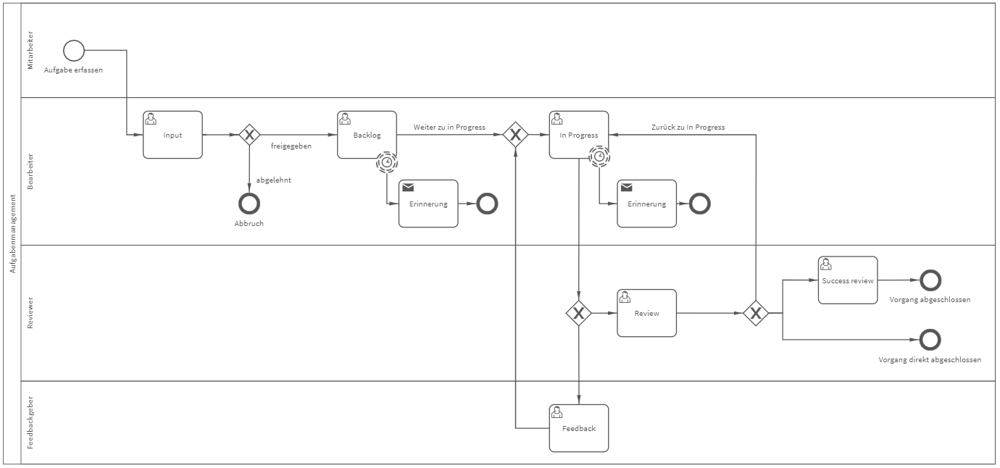

# Aufgabenmanagement
## Bild

**Rollen:** Mitarbeiter, Bearbeiter, Reviewer, Feedbackgeber

Mit dem Prozess „Aufgabenmanagement“ können Sie Aufgaben und Projekte strukturiert erfassen und abarbeiten. Die Aufgaben durchlaufen dabei folgende Prozessschritte:

 - Input
 - Backlog
 - In Progress
 - Review

Zudem können Sie zusätzlich Feedback zum Zwischenstand Ihrer Aufgabe anfordern oder eine Erfolgsprüfung bzw. Success review anschließen.
Damit keine Aufgaben „unter den Tisch fallen“, können Sie sich Erinnerungen hinterlegen, sodass Sie das System automatisch an die Erledigung der Aufgabe erinnert.
Lesen Sie mehr zum Aufgabenmanagement in unserem Blogbeitrag: **Prozess des Monats Juli – Aufgabenmanagement** unter [https://www.roxtra.com/blog/prozess-des-monats-juli-aufgabenmanagement/](https://www.roxtra.com/blog/prozess-des-monats-juli-aufgabenmanagement/)