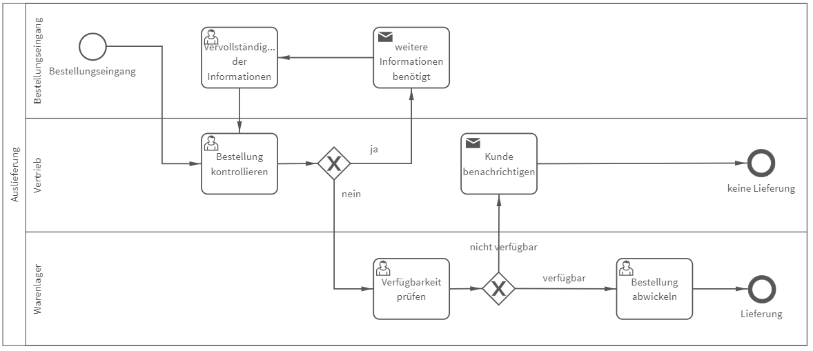

# Auslieferung
## Bild

**Rollen:** Bestellungseingang, Vertrieb, Warenlager

Der Prozess „Auslieferung“ bildet den internen Prozess vom Bestellungseingang bis hin zur Abwicklung der Bestellung ab. Die Bestellung wird registriert, kontrolliert, Informationen ggfs. vervollständigt, die Verfügbarkeit der Ware geprüft und zu guter Letzt ausgeliefert. Im Prozess werden darüber hinaus die Benachrichtigungen an Beteiligte automatisiert. Beispielsweise erhält die Rolle „Bestellungseingang“ automatisch eine Benachrichtigung vom Vertrieb, falls Informationen unvollständig oder falsch sind und wird aufgefordert eine Korrektur durchzuführen.