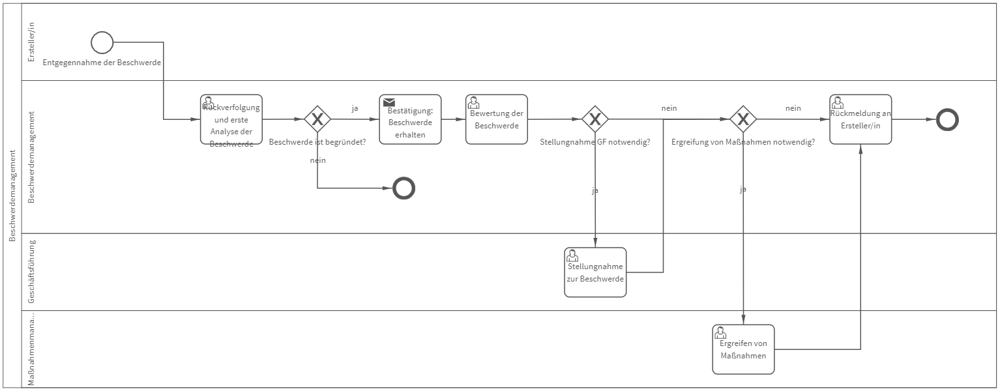

# Beschwerdemanagement
## Bild

**Rollen:** Ersteller, Beschwerdemanagement, Geschäftsführung, Maßnahmenmanagement

Der Prozess „Beschwerdemanagement“ beginnt mit der Entgegennahme der Beschwerde durch den Ersteller. Die gemeldete Beschwerde wird im Anschluss an das Beschwerdemanagement (BM) weitergeleitet. Das BM verfolgt die Beschwerde zurück, führt eine Analyse durch und entscheidet darüber, ob die Beschwerde begründet ist oder nicht. Ist die Beschwerde unbegründet, wird der Prozess an dieser Stelle beendet. 
Bei begründeten Beschwerden erhält der Ersteller die Rückmeldung, dass die Beschwerde eingegangen ist und weitere Maßnahmen ergriffen werden. 
Im nächsten Schritt bewertet das BM den vorliegenden Fall und entscheidet, ob eine Stellungnahme der Geschäftsführung und/oder weitere Maßnahmen notwendig sind. Entsprechend den Entscheidungen des BM erhalten die Geschäftsführung bzw. das Maßnahmenmanagement Aufgaben. Nach Abschluss dieser Aufgaben erhält das BM die Aufgabe eine Rückmeldung an den Ersteller zu versende und der Prozess ist beendet.