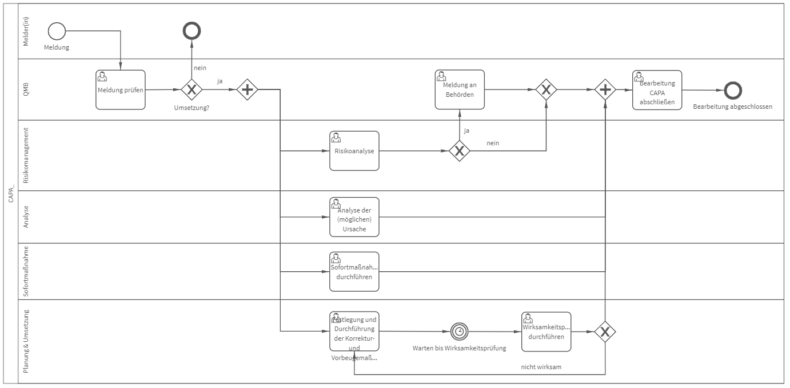

# CAPA
## Bild

## Beschreibung 

**Rollen:** Melder(in), QMB, Risikomanagement, Analyse, Sofortmaßnahme, Planung & Umsetzung

Der Prozess „CAPA“ beinhaltet die Meldung, Analyse und Bearbeitung von Korrektur- und Vorbeugemaßnahmen.
Gestartet wird der Prozess durch die Erstellung einer Meldung. Die Meldung wird anschließend vom QMB geprüft. Der QMB entscheidet mit dem Feld „Meldung umsetzen“ ob die Meldung umgesetzt werden soll oder nicht.

Entscheidet der QMB, dass die Meldung umgesetzt wird, werden folgende Aufgaben gestartet:
- Risikoanalyse
- Analyse der (möglichen) Ursache
- Sofortmaßnahme durchführen
- Festlegung und Durchführung von Korrektur- und Vorbeugemaßnahmen

Die _Risikoanalyse_ wird vom Risikomanagement durchgeführt. Dies beinhaltet auch die Bewertung ob eine Meldung an zuständige Behörden notwendig ist oder nicht. Bewertet das Risikomanagement das Risiko als meldepflichtig und schließt die Risikoanalyse ab, startet die Aufgabe „Meldung an Behörde“. Ist eine Meldung nicht notwendig, ist der Prozess für das Risikomanagement abgeschlossen.
Die _Analyse der (möglichen) Ursachen_ obliegt der Rolle „Analyse“. Im Rahmen dieser Aufgabe sollen Ursachen identifiziert und bewertet werden.
Oftmals zieht eine Meldung Sofortmaßnahmen nach sich. Diese werden mit der Aufgabe „_Sofortmaßnahmen durchführen_“ dokumentiert.
Die „_Festlegung und Durchführung von Korrektur- und Vorbeugemaßnahmen_“ umfasst die Dokumentation der festgelegten und durchgeführten CAPA sowie die Festlegung eines Datums zur Wirksamkeitsprüfung. Ist das festgelegte Datum erreicht, startet die Aufgabe „Wirksamkeitsprüfung“. Darin wird die Wirksamkeit der CAPA bewertet. Werden die Korrektur- und Vorbeugemaßnahmen mit "nicht wirksam" oder "teilweise wirksam" bewertet, ist die Festlegung neuer Maßnahmen erforderlich. Werden die Korrektur- und Vorbeugemaßnahmen mit "wirksam" bewertet, startet die Aufgabe „Bearbeitung CAPA abschließen“. Damit kann Bearbeitung der CAPA abgeschlossen werden.