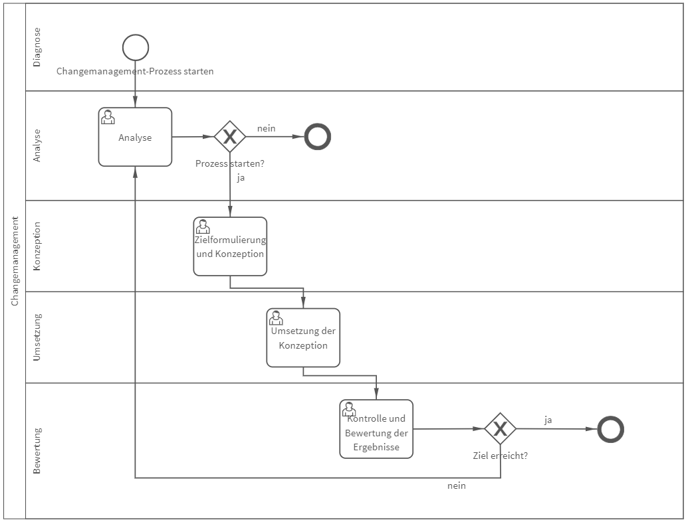

# Changemanagement
## Bild

**Rollen:** Diagnose, Analyse, Konzeption, Umsetzung, Bewertung

Der Prozess „Changemanagement“ bildet die strukturierte Vorgehensweise zur Umsetzung von Änderungen ab. Der Prozess durchläuft dabei im ersten Schritt die Analyse-Phase in der entschieden wird, ob ein Changemanagement-Prozess in diesem Fall Sinn macht oder nicht. 
Wird der Prozess für sinnvoll erachtet, erfolgt im nächsten Schritt die Formulierung einer Zielsetzung sowie die Konzeption des Vorgehens. Im Anschluss wird das Konzept verwirklicht und daraufhin die Ergebnisse kontrolliert und bewertet. Der Prozess ist beendet, sobald das Ziel erreicht wurde.