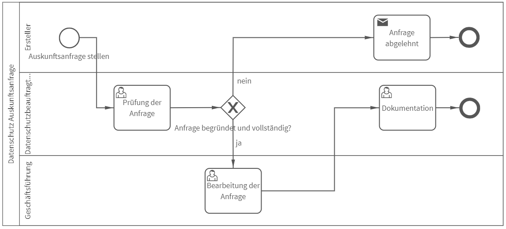

# Datenschutz – Auskunftsanfrage
## Bild

**Rollen:** Ersteller, Datenschutzbeauftragter, Geschäftsführung

Der Prozess „Datenschutz – Auskunftsanfrage“ bildet die Abwicklung einer Auskunftsanfrage nach Art. 15 DSGVO ab.
Dabei stellt der Ersteller die Anfrage, der Datenschutzbeauftragte (DSB) prüft die Anfrage und lehnt diese ab oder leitet sie zur Bearbeitung an die Geschäftsführung weiter. Die Geschäftsführung bearbeitet die Anfrage und gibt entsprechend Auskunft über die angefragten Informationen. Im Anschluss wird die Anfrage durch den Datenschutzbeauftragten dokumentiert und der Prozess ist beendet. 
Sollte die Anfrage abgelehnt werden, erhält der Ersteller automatisch eine Benachrichtigung mit der zugehörigen Begründung des DSB.