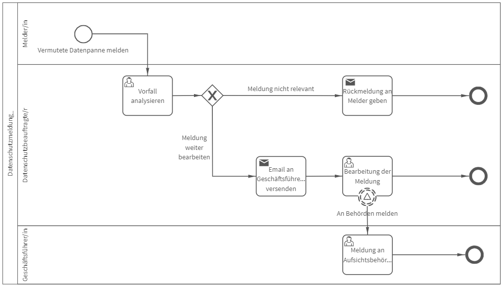

# Datenschutzmeldung
## Bild

## Beschreibung 

**Rollen:** Melder/in, Datenschutzbeauftragte/r, Geschäftsführer/in

Im Prozess „Datenschutzmeldung“ werden vermutete Datenpannen gemeldet, analysiert und bei Bedarf die Geschäftsführung sowie die zuständigen Behörden benachrichtigt. Darüber hinaus werden Maßnahmen definiert.

Der Prozess beginnt mit der Meldung der vermuteten Datenpanne durch den/die Melder/in. Die Meldung beinhaltet dabei unter anderem Datum und Uhrzeit des Vorfalls, eine Beschreibung des Vorfalls, die betroffenen Abteilungen, die Art des damit verbundenen Risikos, betroffene Personengruppen und Anzahl der betroffenen Personen und Datensätze.

Im nächsten Prozessschritt wird die Meldung durch die/den Datenschutzbeauftragte/n analysiert. Es ist zu bewerten, ob die Meldung berechtigt ist oder nicht. Zudem werden der Risikowert, die Art des Risikos, ggfs. ein Kommentar zur Analyse und der/die Geschäftsführer/in welche/r zu benachrichtigen ist, angegeben.

Wird die Meldung als nicht berechtigt bewertet, erhält der/die Melderin folgende Benachrichtigung:

_Guten Tag Vorname Nachname (Melder/in),_

_vielen Dank für Ihre Meldung "Titel". Nach eingehender Prüfung wurde festgestellt, dass diese Meldung keine Relevanz für den Datenschutz nach § 33 DSGVO hat._

_Trotzdem möchten wir uns dafür bedanken, dass Sie das Thema Datenschutz ernst nehmen._

_Mit freundlichen Grüßen  
Vorname Nachname (Datenschutzbeauftragte/r)_

Der zuvor angegebene Titel wird automatisch unter „Titel“ eingefügt.

Wird die Meldung als berechtigt bewertet, wird der/die angegebene Geschäftsführer/in wie folgt benachrichtigt:

_Guten Tag Vorname Nachname (Geschäftsführer/in),_

_wir haben eine neue relevante Datenschutzmeldung erhalten. Wir werden die Meldung bearbeiten._

_Vorname Nachname (Datenschutzbeauftragte/r)_

Zusätzlich zur Nachricht erhält der/die Geschäftsführer/in die bisher angegebenen Informationen (z. B. Datum/Uhrzeit des Vorfalls, Art des Risikos, Anzahl der Datensätze).

Nachdem die Geschäftsführung benachrichtigt wurde, erhält der/die Datenschutzbeauftragte die Aufgabe, die Meldung zu bearbeiten. Hierbei ist zu entscheiden, ob die Betroffenen informiert werden müssen. Zur Bearbeitung gehört darüber hinaus eine Beschreibung der möglichen Ursache des Vorfalls, ergriffener und geplanter Maßnahmen, vorgeschlagene zukünftige Maßnahmen und ein Kommentar zur Bearbeitung. Wird die Meldung an die zuständige Aufsichtsbehörde als notwendig erachtet, erhält die Geschäftsleitung die Aufgabe eine Meldung durchzuführen. Hierbei sind das Datum und die Uhrzeit der Meldung an die Behörden, ein Kommentar zur Meldung sowie die eigentliche Meldung selbst zu dokumentieren. Ist die Meldung an die Aufsichtsbehörden erledigt oder muss die Datenpanne nicht gemeldet werden, ist der Prozess abgeschlossen.