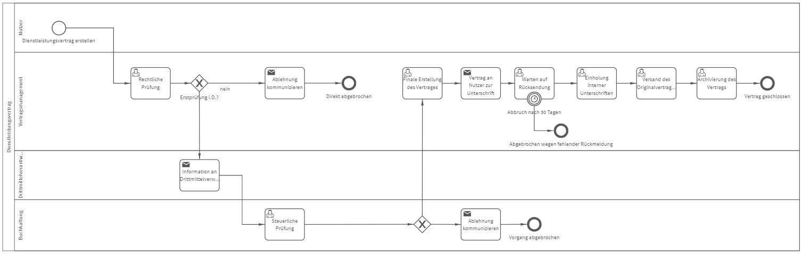

# Dienstleistungsvertrag
## Bild

**Rollen:** Nutzer, Vertragsmanagement, Drittmittelverantwortliche, Buchhaltung

Der Prozess „Dienstleistungsvertrag“ bildet eine Möglichkeit zur Erstellung, Prüfung und Unterzeichnung von Dienstleistungsverträgen ab.
Der Prozess startet mit dem Antrag für einen neuen Dienstleistungsvertrag durch den Nutzer. Dieser Antrag wird durch das Vertragsmanagement einer rechtlichen Prüfung unterzogen. Fällt der Antrag bei dieser Erstprüfung durch, wird die Ablehnung an den Nutzer kommuniziert und der Vorgang abgebrochen.
Besteht der Antrag die Erstprüfung, werden die Drittmittelverantwortlichen informiert und der Vertrag wird zur steuerlichen Prüfung an die Buchhaltung weitergeleitet.
Fällt der Antrag bei der steuerlichen Prüfung durch, wird die Ablehnung an den Nutzer kommuniziert und der Vorgang abgebrochen. Besteht der Antrag die steuerliche Prüfung, wird dem Vertragsmanagement die Aufgabe zur finalen Erstellung des Vertrages zugewiesen.
Anschließend wird dem Nutzer der Vertrag zur Unterschrift zugesendet. Sendet der Nutzer den Vertrag nicht binnen 30 Tagen zurück, wird der Vorgang abgebrochen.
Wird der Vertrag binnen 30 Tagen vom Nutzer unterschrieben zurückgesendet, erhält das Vertragsmanagement die Aufgabe die internen Unterschriften einzuholen. Wurde der Vertrag von allen Parteien unterzeichnet, wird jeder Partei ein vollständig unterschriebenes Exemplar zugesendet und der Vertrag wird archiviert. Der Prozess ist damit beendet.