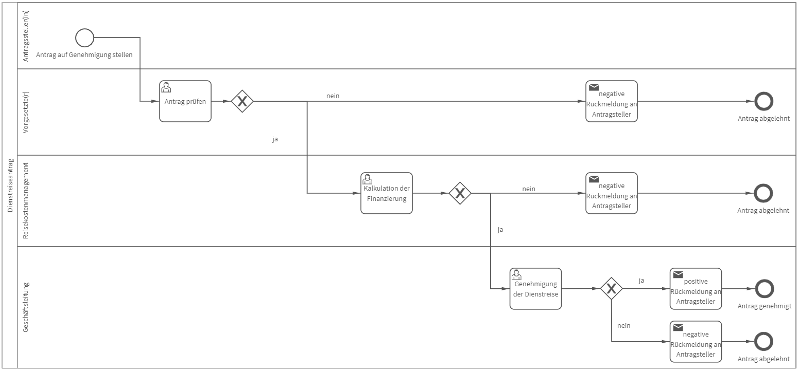

# Dienstreiseantrag
## Bild

## Beschreibung 

**Rollen:** Antragsteller(in), Vorgesetzte(r), Reisekostenmanagement, Geschäftsleitung

Der Prozess „Dienstreiseantrag“ beinhaltet das Antragsverfahren zur Durchführung einer Dienstreise. Der Prozess beginnt mit der Antragsstellung. Darin werden verschiedene Pflichtinformationen (Reisegrund, Ziel der Dienstreise, Zeitraum der Reise etc.) vom System abgefragt.

Anschließend prüft der/die Vorgesetzte den Antrag und entscheidet mit dem Feld „Antrag wird stattgegeben“ über den weiteren Verlauf des Antrags. Wird dem Antrag nicht stattgegeben, ist eine Begründung hierfür abzugeben. Der/die Antragsteller/in erhält automatisch folgende Nachricht:

_Hallo Vorname Nachname (Antragsteller/in),_

_Ihr Dienstreiseantrag konnte nicht genehmigt werden.  
Begründung:_

_Viele Grüße  
Vorname Nachname (Vorgesetzte/r)_

In dieser Rückmeldung werden unter dem Punkt „Begründung“ automatisch die Informationen eingefügt, die bei Ablehnung des Antrags als Begründung abgegeben wurden.

Wird dem Antrag vom Vorgesetzten stattgegeben, startet die Aufgabe „Kalkulation der Finanzierung“. Das Reisekostenmanagement bewertet, ob die finanziellen Mittel für die Dienstreise zur Verfügung stehen. Ist dies nicht der Fall, sollte ein Hinweis an den Antragsteller formuliert werden. Der/die Antragsteller/in erhält automatisch folgende Nachricht:

_Hallo Vorname Nachname (Antragsteller/in),_

_Ihr Dienstreiseantrag konnte nicht genehmigt werden.  
Hinweis:_

_Viele Grüße  
Vorname Nachname (Reisekostenmanagement)_

In dieser Rückmeldung werden unter dem Punkt „Hinweis“ automatisch die Informationen eingefügt, die als Hinweis an den Antragsteller formuliert werden, sobald die finanziellen Mittel der Dienstreise als nicht verfügbar eingestuft werden.

Stehen die finanziellen Mittel zur Verfügung, wird der Antrag zur Genehmigung an die Geschäftsleitung weitergeleitet. Diese entscheidet final ob der Antrag stattgegeben wird oder nicht. Wird dem Antrag nicht final stattgegeben, ist ein Kommentar an den/die Antragsteller/in zu verfassen. Der/die Antragsteller/in erhält automatisch folgende Nachricht:

_Hallo Vorname Nachname (Antragsteller/in),_

_Ihr Dienstreiseantrag wurde abgelehnt.  
Kommentar:_

_Viele Grüße  
Vorname Nachname (Geschäftsleitung)_

In dieser Rückmeldung werden unter dem Punkt „Kommentar“ automatisch die Informationen eingefügt, die bei Ablehnung des Antrags als Kommentar an den Antragsteller abgegeben wurden.

Wird dem Antrag von der Geschäftsleitung final stattgegeben, erhält der/die Antragsteller/in folgende Nachricht automatisch:

_Hallo Vorname Nachname (Antragsteller/in),_

_Ihr Dienstreiseantrag wurde final genehmigt. Ich wünsche Ihnen eine erfolgreiche Reise._

_Viele Grüße  
Vorname Nachname (Geschäftsleitung)_

Der Prozess ist damit beendet.