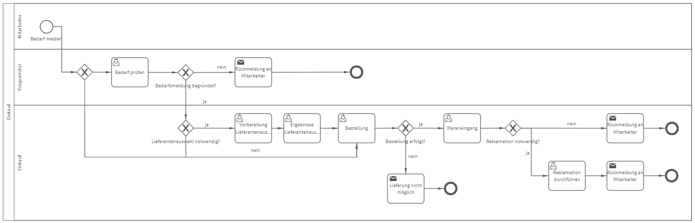

# Einkaufsprozess
## Bild

**Rollen:** Mitarbeiter, Vorgesetzter, Einkauf

Der Einkaufsprozess startet durch die Bedarfsmeldung durch den Mitarbeiter. Dabei ist unter anderem der benötigte Artikel, die benötigte Menge und der ungefähre Auftragswert anzugeben.
Die Auswahl des ungefähren Auftragswertes (größer oder kleiner 100 Euro) entscheidet über den nächsten Prozessschritt.
Ist der Auftragswert größer als 100 Euro, prüft der Vorgesetzte die Meldung und entscheidet darüber ob der Artikel bestellt werden soll oder nicht. Dabei entscheidet der Vorgesetzte auch ob eine Lieferantenauswahl gemäß Normvorgaben (z. B. ISO 9001) notwendig ist.
Wird die Bedarfsmeldung abgelehnt, erhält der Mitarbeiter folgende Nachricht:

_Hallo Mitarbeiter (Vorname, Nachname)_
_die Bestellung von 'Artikel' wurde nicht veranlasst._
_Begründung: Begründung Vorgesetzter_
_Viele Grüße_
_Vorgesetzter (Vorname, Nachname)_

Die Bezeichnung des Artikels sowie die Begründung des Vorgesetzten werden automatisch in die Nachricht eingefügt.
Wird die Auswahl eines neuen Lieferanten als notwendig eingestuft, erhält der Einkauf die Aufgaben „Vorbereitung Lieferantenauswahl“ und „Ergebnisse Lieferantenauswahl“. Ist keine Lieferantenauswahl notwendig, erhält der Einkauf direkt die Aufgabe zur Bestellung des Artikels.
Falls der beantragte Artikel nicht lieferbar ist, erhält der Mitarbeiter folgende Nachricht:

_Hallo Mitarbeiter (Vorname, Nachname)_
_die Bestellung von 'Artikel' war leider nicht möglich._
_Grund hierfür: Grund_
_Viele Grüße_
_Einkauf (Vorname, Nachname)_

Die Bezeichnung des Artikels sowie der angegebene Grund werden automatisch in die Nachricht eingefügt.
Ist die Bestellung erfolgreich erfolgt, erhält der Einkauf die Aufgabe den Wareneingang durchzuführen. Hierbei wird der bestellte Artikel auf Mängel kontrolliert. Weist der Artikel Mängel auf, ist dies beim Lieferanten zu reklamieren.
Nach Abschluss der Reklamation erhält der Mitarbeiter folgende Nachricht:

_Hallo Mitarbeiter (Vorname, Nachname)_
_die Bestellung 'Artikel' musste reklamiert werden._
_Grund hierfür: Reklamationsgrund_
_Viele Grüße_
_Einkauf (Vorname, Nachname)_

Ist keine Reklamation notwendig, erhält der Mitarbeiter folgende Nachricht:

_Hallo Mitarbeiter (Vorname, Nachname)_
_die Bestellung 'Artikel' ist angekommen._
_Viele Grüße_
_Einkauf (Vorname, Nachname)_

Die Bezeichnung des Artikels wird automatisch in die Nachricht eingefügt. Der Einkaufsprozess ist damit abgeschlossen.