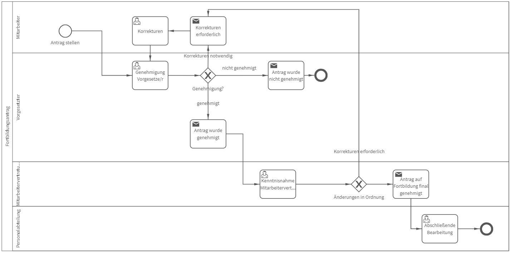

# Fortbildungsantrag
## Bild

**Rollen:** Mitarbeiter,  Vorgesetzter, Mitarbeitervertretung, Personalabteilung

Der Prozess „Fortbildungsantrag“ startet mit der Antragsstellung durch den Mitarbeiter. Dabei sind unter anderem eine Beschreibung der Fortbildung sowie voraussichtliche Kosten anzugeben.

Der Antrag wird anschließend vom Vorgesetzten geprüft und genehmigt. Dabei wird der Vorgesetzte aufgefordert anzugeben, ob der Antrag genehmigt wird, nicht genehmigt wird oder ob Korrekturen erforderlich sind.

Sollten Korrekturen erforderlich sind, erhält der Mitarbeiter die Aufgabe zur Korrektur sowie folgende Benachrichtigung:

*Guten Tag Mitarbeiter (Vorname, Nachname)
ihrem Fortbildungsantrag wurde vorerst nicht stattgegeben.
Bitte führen Sie die folgenden Korrekturen durch:
Viele Grüße
Vorgesetzter (Vorname, Nachname)*

In die Nachricht werden automatisch die zuvor angegebenen, notwendigen Korrekturen eingefügt. Nachdem der Mitarbeiter die Korrekturen durchgeführt hat, wird der Antrag erneut zur Prüfung an den Vorgesetzten weitergeleitet. Dieser entscheidet wiederum über die Genehmigung, Korrektur oder Ablehnung.

 Wird der Antrag nicht genehmigt, erhält der Mitarbeiter die folgende Benachrichtigung:

*Guten Tag Mitarbeiter (Vorname, Nachname)
ihrem Fortbildungsantrag wurde nicht stattgegeben.
Begründung:
Viele Grüße
Vorgesetzter (Vorname, Nachname)*

In die Nachricht wird automatisch die zuvor angegebene Begründung eingefügt. Der Prozess ist damit beendet.

Wird der Fortbildungsantrag vom Vorgesetzten genehmigt, erhält der Mitarbeiter folgende Benachrichtigung:

*Guten Tag Mitarbeiter (Vorname, Nachname)
Ihr Antrag auf Fortbildung wurde vom Vorgesetzten genehmigt und wird nun von der Mitarbeitervertretung geprüft.*

Die Mitarbeitervertretung bekommt daraufhin die Aufgabe den Antrag zu prüfen und bei Bedarf ebenfalls erforderliche Korrekturen anzugeben.

Ist der Fortbildungsantrag in Ordnung, erhält der Mitarbeiter die Benachrichtigung:

*Guten Tag Mitarbeiter (Vorname, Nachname)
Ihr Antrag auf Fortbildung wurde final genehmigt. Es sind keine weiteren Korrekturen notwendig.
Die Personalabteilung wird automatisch informiert.*

Zudem wird die Personalabteilung informiert und unter anderem dazu aufgefordert ggfs. die Informationen in der Personalakte zu aktualisieren. Der Prozess wurde damit erfolgreich abgeschlossen.