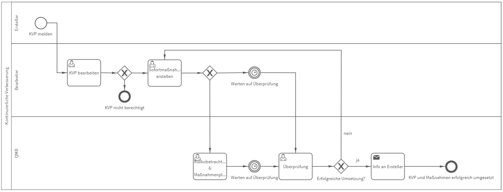

# Kontinuierliche Verbesserung
## Bild

**Rollen:** Ersteller, Bearbeiter, QMB

Der Prozess „Kontinuierliche Verbesserung“ bildet eine Möglichkeit ab, um mit Meldungen zur kontinuierlichen Verbesserung (KVP-Meldungen) zu verfahren.
Die jeweilige Meldung wird dabei im ersten Schritt bearbeitet und bewertet. Es werden Sofortmaßnahmen ergriffen und im Anschluss ggfs. eine detaillierte Risikobetrachtung und Maßnahmenplanung durchgeführt.
Die Maßnahmen werden überprüft und es wird über die erfolgreiche Umsetzung entschieden.
Nach dem erfolgreichen Abschluss der Maßnahmen wird der Ersteller der Meldung automatisch benachrichtigt.