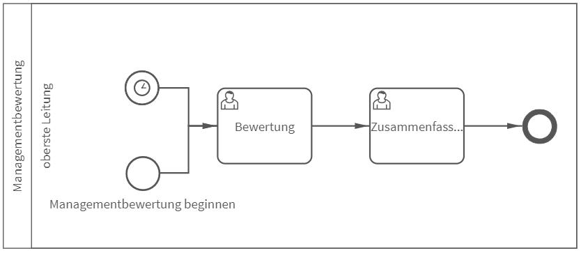

# Managementreview
## Bild

**Rollen:** oberste Leitung

Nach DIN EN ISO 9001:2015-11 ist ein Qualitätsmanagementsystem in regelmäßigen Abständen durch die oberste Leitung zu bewerten. Dabei muss dessen Eignung, Angemessenheit, Wirksamkeit und das Zusammenspiel mit der strategischen Ausrichtung der Organisation sichergestellt werden. Der Vorgang „Managementbewertung“ wirkt unscheinbar, hat es jedoch durchaus in sich. Er startet i.d.R. einmal jährlich mittels Timer oder kann manuell gestartet werden. Beim Starten der Managementbewertung ist das Kalenderjahr, für das die Bewertung durchgeführt werden soll, anzugeben.

Im nächsten Schritt – der Bewertung – werden entsprechend den Vorgaben der ISO 9001 Aspekte des QM-systems wie beispielsweise der Status von Maßnahmen, die Ergebnisse von Audits und die Angemessenheit von Ressourcen bewertet. Zur Bewertung werden die Aspekte in positiv, eher positiv, neutral, eher negativ oder negativ eingeordnet. Zu jedem Themengebiet können zudem Hinweise und Anlagen vermerkt und der Handlungsbedarf festgelegt werden.

Sobald alle Bewertungen durchgeführt wurden, kann zum nächsten Schritt, der Zusammenfassung, übergegangen werden. Hierbei sind ein abschließender Kommentar bzw. ein Fazit anzugeben. Anschließend ist der Prozess beendet.

Eine Besonderheit dieses Vorgangs ist die, speziell für diesen Vorgang konzipierte, Berichtsvorlage.
roXtra ermöglicht es Ihnen in der Ansicht „Vorgangsliste“ zu einem ausgewählten Prozess einen Bericht als Word-Datei oder PDF zu exportieren. Die Berichtsvorlage für den Vorgang „Managementreview“ ermöglicht es Ihnen alle Daten übersichtlich in einem Bericht zusammen zu fassen und das mit nur einem Klick.