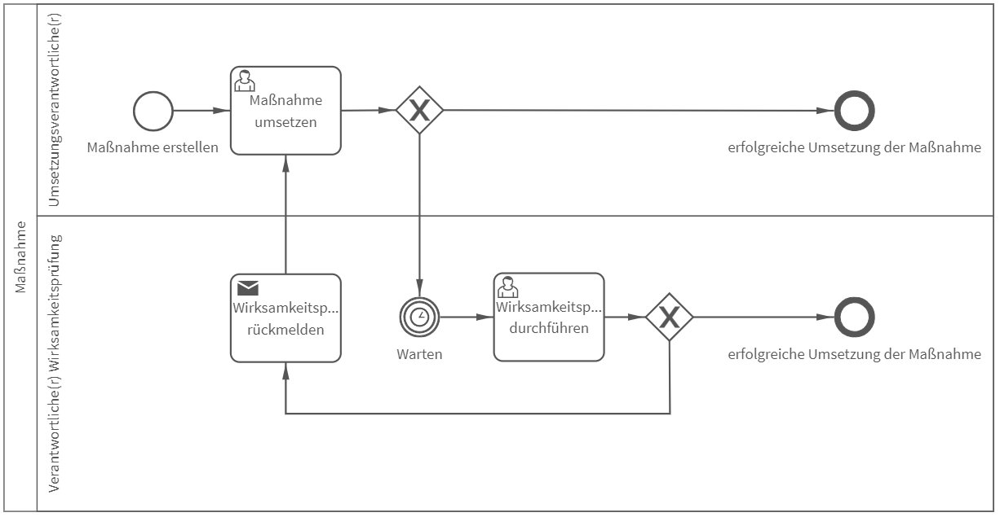

# Maßnahme
## Bild

## Beschreibung 

**Rollen:** Umsetzungsverantwortliche/r, Verantwortliche/r Wirksamkeitsprüfung

Der Prozess „Maßnahme“ beschreibt die Umsetzung einer Maßnahme beispielsweise im Rahmen des kontinuierlichen Verbesserungsprozesses.

Im ersten Schritt des Prozesses wird eine Maßnahme erstellt. Hierfür wird von der/dem Umsetzungsverantwortlichen ein elektronisches Formular ausgefüllt. In diesem Formular werden Informationen wie die Beschreibung der Maßnahme, Hinweise zur Umsetzung, mögliche Auslöser, ein Zieltermin und benötigte Ressourcen angegeben.

Nachdem die Maßnahme erstellt wurde, ist wiederum der/die Umsetzungsverantwortliche für die Durchführung der Maßnahme zuständig. In diesem Prozessschritt ist die Beschreibung der Umsetzung, die Angaben über benötigte personelle Ressourcen sowie dem Erledigungsstatus notwendig. **Achtung**: Dieser Prozessschritt kann nur abgeschlossen werden, wenn der Erledigungsstatus 100 Prozent entspricht. Bei anderen Angaben erhalten Sie eine Fehlermeldung. Am Ende der Umsetzung der Maßnahme wird zudem festgelegt ob eine Wirksamkeitsprüfung notwendig ist oder nicht. Ist keine Wirksamkeitsprüfung notwendig, ist der Prozess beendet. Ist eine Wirksamkeitsprüfung notwendig, muss ein Datum der Wirksamkeitsprüfung angegeben werden.

Wurde für den Prozess ein Datum zur Wirksamkeitsprüfung hinterlegt, startet nach Ablauf dieses Datums die Durchführung der Wirksamkeitsprüfung. Hierfür ist die Beschreibung der Prüfung sowie die Angabe über den Status der Wirksamkeit notwendig. **Achtung**: Die Prüfung wird nur abgeschlossen, wenn die Wirksamkeit mit 100 Prozent bewertet wird. Wird der Status der Wirksamkeit mit weniger als 100 Prozent bewertet, erhält der/die Umsetzungsverantwortliche folgende Nachricht:

_Hallo Vorname Nachname (Umsetzungsverantwortliche/r)_

_Die Wirksamkeitsprüfung ergab, dass die Maßnahme lediglich zu XX Prozent wirksam ist._
_Bitte überprüfen Sie die Umsetzung und leiten gegebenenfalls Korrekturmaßnahmen ein._

_Viele Grüße_
_Vorname Nachname (Verantwortliche/r Wirksamkeitsprüfung)_

Der Prozess wird zudem zurück in den Schritt „Maßnahme umsetzen“ gesetzt.
