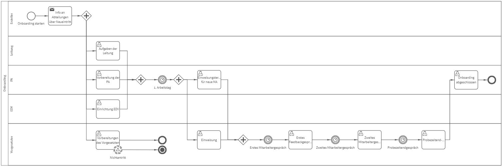

# Onboarding
## Bild

**Rollen:** Ersteller, Leitung, PA, EDV, Vorgesetzter

Mit dem Prozess „Onboarding“ möchten wir Ihnen einen beispielhaften Ablauf zur strukturierten Einarbeitung neuer Mitarbeiter vorstellen. Dank des automatisierten Prozesses wird sichergestellt, dass für Ihr neues Teammitglied alle benötigten Ressourcen ab dem ersten Arbeitstag zur Verfügung stehen. Zudem erinnert Sie roXtra daran, regelmäßig Mitarbeitergespräche durchzuführen, sodass Sie eine optimale Einarbeitungsphase mit kontinuierlichem Feedback gewährleisten können.

Lesen Sie mehr darüber in unserem Blogbeitrag: **Prozess des Monats September – Onboarding** unter [https://www.roxtra.com/blog/prozess-des-monats-september-onboarding/](https://www.roxtra.com/blog/prozess-des-monats-september-onboarding/)