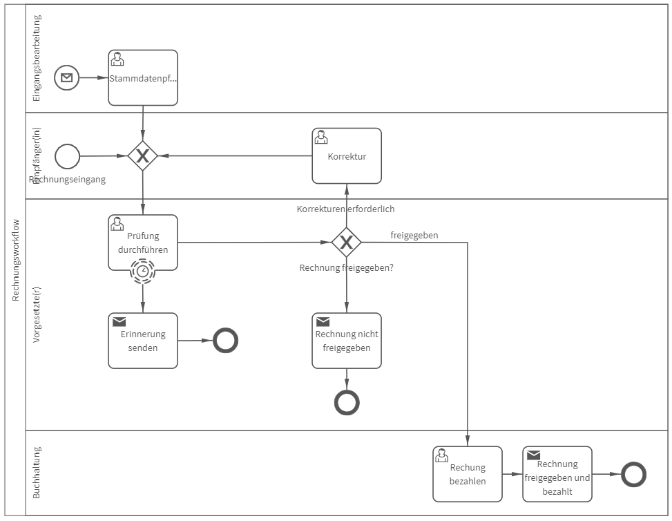

# Rechnungsworkflow
## Bild

**Rollen:** Eingangsbearbeitung, Empfänger, Vorgesetzter, Buchhaltung

Der Prozess „Rechnungsworkflow“ startet per E-Mail (Stammdatenpflege) oder durch den Empfänger bei Rechnungseingang.

Startet der Empfänger den Prozess, ist unter anderem eine Lieferanten-/Kundennummer anzugeben. Zudem kann die Rechnung z. B. als PDF-Datei mit dem Vorgang verknüpft werden.

Anschließend wird die Rechnung zur Prüfung und Freigabe an den Vorgesetzten weitergeleitet. Der Vorgesetzte entscheidet darüber, ob die Rechnung freigegeben wird, Korrekturen notwendig sind oder die Rechnung nicht freigegeben wird. Zudem erhält der Vorgesetzte folgende Erinnerungsnachricht, falls diese Aufgabe nach 7 Tagen nicht erledigt wurde:

_Guten Tag Vorname, Nachname (Vorgesetzter)_
_bei Ihnen liegt die Rechnung ‚Titel‘ zur Prüfung. Bitte führen Sie die Prüfung durch._

Sollten Korrekturen notwendig sein, erhält der Empfänger die Aufgabe zur Korrektur der Rechnung. Wird die Rechnung nicht freigegeben, erhält der Empfänger die folgende Benachrichtigung:

_Hallo Vorname Nachname (Empfänger),_
_die Rechnung 'Titel' wurde nicht freigegeben._
_Begründung: Kommentar Vorgesetzter_

In die Benachrichtigung wird automatisch der Kommentar des Vorgesetzten sowie der Titel der Rechnung eingefügt. Der Rechnungsworkflow ist damit beendet.

Wird die Rechnung freigegeben, erhält die Buchhaltung die Aufgabe die Rechnung zu bezahlen. Im Anschluss daran erhält der Empfänger die Benachrichtigung:

_Hallo Vorname Nachname (Empfänger),_
_die Rechnung 'Titel' wurde freigegeben und bezahlt._

Der Rechnungsworkflow ist damit beendet.