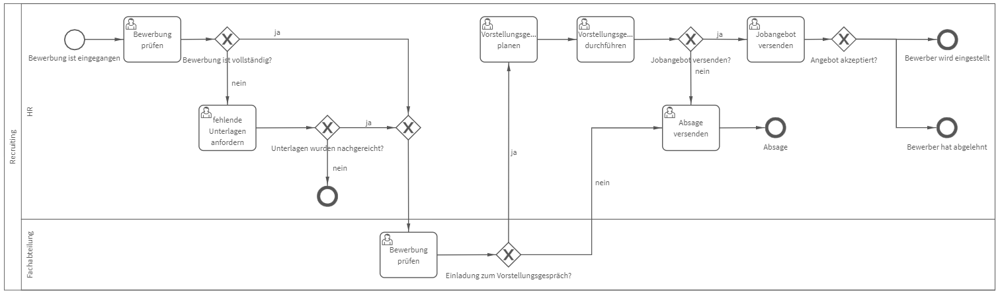

# Recruiting
## Bild

**Rollen:** HR, Fachabteilung

Der Prozess „Recruiting“ beginnt mit dem Eingang einer Bewerbung. Daraufhin überprüft die HR-Abteilung die Bewerbung auf Vollständigkeit. Ist die Bewerbung vollständig, wird sie zur Prüfung durch die Fachabteilung weitergeleitet.

Ist die Bewerbung unvollständig, erhält die HR-Abteilung die Aufgabe die fehlenden Unterlagen anzufordern. Werden die Unterlagen nachgereicht, wird die, nun vollständige Bewerbung, an die Fachabteilung zur Prüfung weitergeleitet. Werden die Unterlagen nicht nachgereicht, ist der Prozess beendet und die Bewerbung wird nicht weiter berücksichtigt.

Die vollständige Bewerbung wird von der Fachabteilung überprüft und sie entscheidet darüber, ob der Kandidat zum Vorstellungsgespräch eingeladen wird oder nicht.

Wird der Kandidat aufgrund der Bewerbungsunterlagen als ungeeignet eingestuft, erhält die HR-Abteilung die Aufgabe eine Absage zu versenden.

Wird der Kandidat aufgrund der Bewerbungsunterlagen als geeignet eingestuft, bekommt die HR-Abteilung die Aufgaben das Vorstellungsgespräch zu planen und anschließend durchzuführen.

Nach dem Vorstellungsgespräch erhält die HR-Abteilung die Aufgabe eine Absage oder ein Jobangebot zu versenden. Nach der Absage ist der Recruiting Prozess beendet. Nach dem Versenden eines Jobangebot endet der Prozess entweder damit, dass der Bewerber das Angebot annimmt und eingestellt wird oder ablehnt.