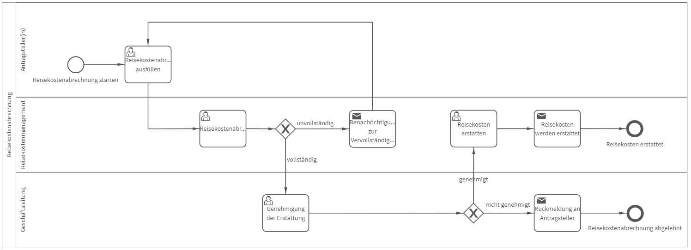

# Reisekostenabrechnung
## Bild

## Beschreibung 

**Rollen:** Antragsteller/in, Reisekostenmanagement, Geschäftsleitung

Der Prozess Reisekostenabrechnung erleichtert Ihnen die Abrechnung ihrer Reisekosten.

Nach dem Start der Reisekostenabrechnung kann der/die Antragsteller/in das ausgefüllte Dokument zur Reisekostenabrechnung hochladen.

Dieses wird an das Reisekostenmanagement weitergeleitet und in Hinblick auf die Vollständigkeit bewertet. Ist das Dokument unvollständig, erhält der/die Antragsteller/in folgende Benachrichtigung:

_Hallo Vorname Nachname (Antragsteller/in),_

_Folgende Angaben Ihrer Reisekostenabrechnung fehlen:_
_fehlende Angaben_

_Bitte vervollständigen Sie die Angaben._

_Viele Grüße  
Vorname Nachname (Reisekostenmanagement)_

In dieser Rückmeldung werden unter dem Punkt „fehlende Angaben“ automatisch die Informationen eingefügt, die bei Unvollständigkeit des Antrags angegeben wurden.

Wurde der Antrag vom Reisekostenmanagement als vollständig bewertet, wird er zur Genehmigung an die Geschäftsleitung weitergeleitet. Die Geschäftsleitung bewertet die Abrechnung und gibt die Erstattung der kosten frei. Wird die Erstattung freigegeben, erhält das Reisekostenmanagement die Aufgabe „Reisekosten erstatten“. Nach Erstattung der Reisekosten wird der/die Antragsteller/in wie folgt benachrichtigt:

_Guten Tag Vorname Nachname (Antragsteller/in),_

_Ihre Reisekostenabrechnung wurde freigegeben.  
Die Reisekosten werden zum nächstmöglichen Zeitpunkt erstattet._

_Viele Grüße  
Vorname Nachname (Reisekostenmanagement)_

Der Prozess ist damit beendet.

Gibt die Geschäftsleitung die Erstattung der Reisekosten nicht frei, erhält der/die Antragsteller/in folgende Nachricht:

_Guten Tag Vorname Nachname (Antragsteller/in),_

_Ihre Reisekostenabrechnung kann vorerst nicht genehmigt werden._
_Begründung:_

_Viele Grüße  
Vorname Nachname Geschäftsleitung_

In dieser Rückmeldung werden unter dem Punkt „Begründung“ automatisch die Informationen eingefügt, die bei Ablehnung des Antrags angegeben wurden. Der Prozess ist damit beendet.