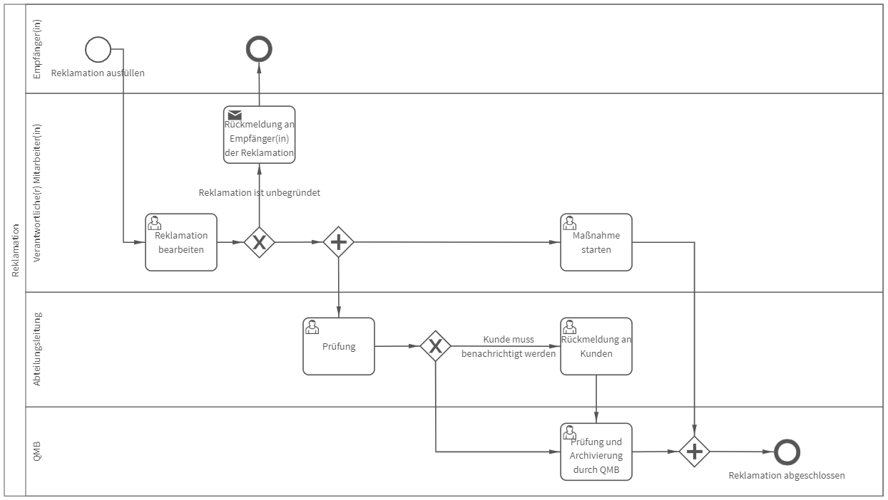

# Reklamation
## Bild

## Beschreibung 

**Rollen:** Empfänger/in, Verantwortliche/r Mitarbeiter/in, Abteilungsleitung, QMB

Der Prozess „Reklamation“ bildet eine Möglichkeit ab, mit Reklamationsmeldungen zu verfahren.

Der/die Empfänger/in füllt im ersten Prozessschritt das Formular zur Reklamation aus. Hierfür sind verschiedene Informationen wie ein Reklamations-Titel, die Kundennummer, der Beschwerdeanlass und die betroffene Abteilung anzugeben.

Das ausgefüllte Formular wird zur Bearbeitung an den/die verantwortliche/n Mitarbeiter/in weitergeleitet. Der/die verantwortliche Mitarbeiter/in bewertet ob die vorliegende Reklamation begründet ist oder nicht. Wird die Reklamation als unbegründet bewertet, ist eine Begründung anzugeben. In diesem Fall erhält der/die Empfänger/in folgende Benachrichtigung:

_Hallo Vorname Nachname (Empfänger/in),_

_Vielen Dank für die Reklamationsmeldung.  
Die Reklamation wurde unter folgender Begründung als unbegründet eingestuft:  
Begründung_

_Viele Grüße  
Vorname Nachname (Verantwortliche/r Mitarbeiter/in)_

Die abgegebene Begründung wird automatisch in die Nachricht eingefügt.

Wird die Reklamation als begründet eingestuft, werden weitere Informationen, wie der mögliche Auslöser und die Auswirkung auf andere Produkte vom verantwortlichen Mitarbeiter erfragt. Nach Angabe der Informationen und Abschluss der Aufgabe, werden zwei weitere, parallellaufende Aufgaben erstellt. Der/die verantwortliche Mitarbeiter/in erhält die Aufgabe „Maßnahme starten“. Die Maßnahme dient der Korrektur und Prävention der vorliegenden Reklamation. Die Abwicklung der Maßnahme kann ggfs. in einem Subprozess erfolgen. _**Informationen darüber wie Sie über einen Subprozess mehrere Prozesse miteinander verknüpfen können, finden Sie im Benutzer-Handbuch roXtra Elektronische Formulare und Vorgänge.**_

Die Abteilungsleitung erhält die Aufgabe „Prüfung“ der Reklamation. Zudem wird im Rahmen dieser Aufgabe bewertet, ob eine Rückmeldung an die Kunden erforderlich ist. Wird die Rückmeldung an die Kunden als notwendig eingestuft, erhält die Abteilungsleitung wiederum die Aufgabe „Rückmeldung an Kunden“.

Wird eine Rückmeldung an die Kunden als nicht notwendig eingestuft oder ist die Rückmeldung an die Kunden abgeschlossen, erhält der/die QMB die Aufgabe „Prüfung und Archivierung“. Der/die QMB dokumentiert den Ablauf der Reklamation für die unternehmenseigene QM-Dokumentation.

Nachdem die Aufgabe von der/dem QMB abgeschlossen wurde, ist der Prozess beendet.