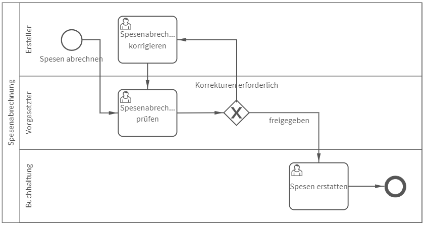
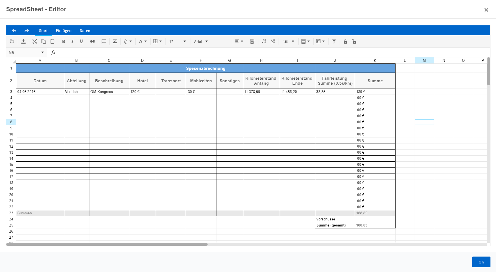

# Spesenabrechnung
## Bild 1

## Bild 2

**Rollen:** Ersteller, Vorgesetzter, Buchhaltung

Der Prozess „Spesenabrechnung“ enthält ein SpreadSheet – eine neue Funktionalität in roXtra Elektronische Formulare. Das Spreadsheet erinnert sehr stark an eine Tabelle, wie sie aus MS Excel bekannt ist.

Die Spesenabrechnung startet mit dem Ausfüllen des Spreadsheets durch den Ersteller. Im SpreadSheet sind bereits Angaben und Formeln hinterlegt, sodass der Ersteller nur noch seine Spesen eintragen muss. Zudem wird der Ersteller aufgefordert den Abrechnungszeitraum sowie einen ggfs. im Vorfeld erhaltenen Vorschuss anzugeben.

Die ausgefüllte Spesenabrechnung wird anschließend automatisch zur Prüfung an den Vorgesetzten weitergeleitet. Dieser entscheidet über die Freigabe oder notwendige Korrekturen.

Sind Korrekturen notwendig, erhält der Ersteller die Aufgabe zur Korrektur der Abrechnung sowie einen Hinweis des Vorgesetzten hierzu.

Sind keine Korrekturen notwendig, erhält die Buchhaltung die Aufgabe die Spesen zu erstatten. Anschließend ist der Prozess beendet.