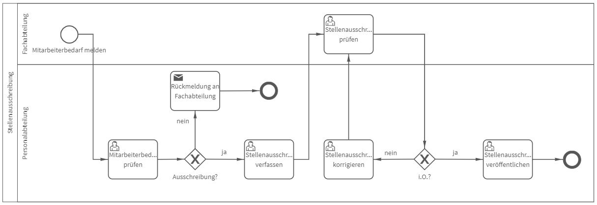

# Stellenausschreibung
## Bild

**Rollen:** Fachabteilung, Personalabteilung

Der Prozess „Stellenausschreibung“ automatisiert die Bedarfsmeldung nach neuem Personal sowie die Erstellung, Überprüfung und Veröffentlichung der Stellenausschreibung durch die Fach- und Personalabteilung.

Der Prozess startet durch die Meldung nach Bedarf an weiterem Personal. Hierbei ist anzugeben in welcher Abteilung Personal benötigt wird, welche Aufgaben erledigt werden sollen, wie das mögliche Arbeitsverhältnis (z. B. Voll- oder Teilzeit) aussieht und welche Voraussetzungen erfüllt werden müssen.

Die Meldung wird anschließend durch die Personalabteilung geprüft und es wird entschieden, ob die Stelle ausgeschrieben werden soll. Entscheidet die Personalabteilung gegen die Ausschreibung der Stelle, erhält die Fachabteilung folgende Nachricht:

_Hallo Vorname Nachname (Fachabteilung),_

_die Stelle "Bezeichnung" wird aus folgendem Grund nicht ausgeschrieben:_
_Begründung_

_Viele Grüße  
Vorname Nachname (Personalabteilung)_

Die Bezeichnung sowie die Begründung der Personalabteilung werden automatisch in die Nachricht eingefügt.

Entscheidet sich die Personalabteilung für die Ausschreibung der Stelle, erhält sie die Aufgabe die Ausschreibung zu verfassen.

Anschließend wird die Stellenausschreibung durch die Fachabteilung geprüft, sind keine Korrekturen erforderlich, kann die Ausschreibung veröffentlicht werden und der Prozess ist beendet. Falls Korrekturen erforderlich sind, erhält die Personalabteilung die Aufgabe die Ausschreibung zu korrigieren. Daraufhin findet erneut die Überprüfung durch die Fachabteilung statt.