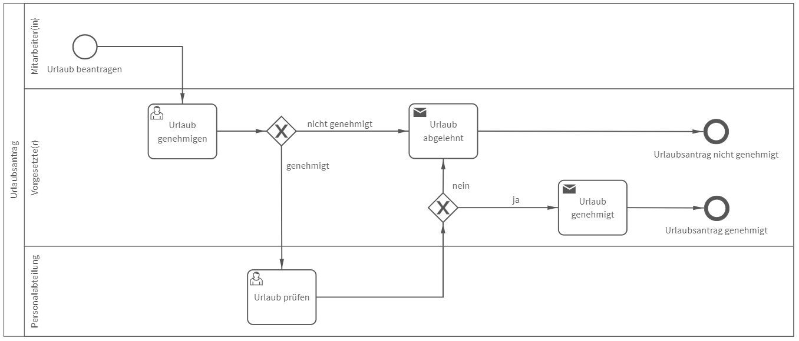

# Urlaubsantrag
## Bild

## Beschreibung 

**Rollen:** Mitarbeiter/in, Vorgesetzte/r, Personalabteilung

Mit dem vorliegenden Prozess wird der Urlaubsantrag mittels eines elektronischen Formulars automatisiert.

Um das Formular vollständig auszufüllen, ist der Zeitraum des Urlaubs (von/bis) sowie die Anzahl der benötigten Urlaubstage anzugeben. Des Weiteren können Angaben über die Urlaubsart und ein Kommentar abgegeben werden. Nachdem der/die Mitarbeiter/in den Antrag ausgefüllt hat, wird dieser automatisch an den/die Vorgesetzte/n weitergeleitet.

Der/die Vorgesetzte erhält die Aufgabe zur Genehmigung des Urlaubs. Genehmigt der/die Vorgesetzte den Urlaub nicht, erhält der/die Mitarbeiter/in folgende Benachrichtigung:

_Hallo Vorname Nachname (Mitarbeiter/in)_

_Ihr Urlaubsantrag vom XX bis XX wurde nicht genehmigt._
_Begründung:_

_Mit freundlichen Grüßen  
Vorname Nachname (Vorgesetzte/r)_

In der Benachrichtigung werden automatisch die Datumsangaben des Urlaubs sowie die abgegebene Begründung der/des Vorgesetzen eingetragen.
Genehmigt der/die Vorgesetzte den Urlaub, erhält die Personalabteilung die Aufgabe den Urlaub zu prüfen.

Die Anzahl der Resturlaubstage ist zu überprüfen und anzugeben. Die Personalabteilung bewertet daraufhin ob dem/der Mitarbeiter/in genügend Resturlaub für den beantragten Urlaub zur Verfügung steht oder nicht. Ist dies nicht der Fall, ist ein Hinweis für den/die Mitarbeiter/in anzugeben. Der/die Mitarbeiter/in erhält daraufhin die oben aufgeführte Benachrichtigung mit dem Unterschied, dass unter dem Punkt „Begründung“ der Hinweis der Personalabteilung eingeführt wird.

Stehen dem/der Mitarbeiter/in ausreichend Resturlaubstage zur Verfügung, erhält der/die Mitarbeiterin die folgende Benachrichtigung:

_Hallo Vorname Nachname (Mitarbeiter/in)_

_Ihrem Urlaubsantrag vom XX bis XX wurde stattgegeben. Ich wünsche Ihnen einen schönen Urlaub._

_Mit freundlichen Grüßen  
Vorname Nachname (Vorgesetzte/r)_

Damit ist der Prozess „Urlaubsantrag“ abgeschlossen.