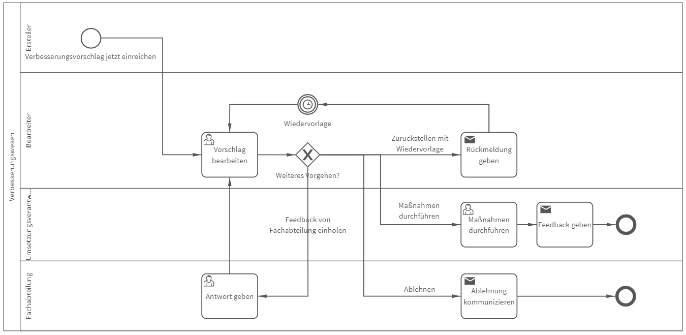

# Verbesserungswesen
## Bild

**Rollen:** Ersteller, Bearbeiter, Umsetzungsverantwortlicher, Fachabteilung

Der Prozess „Verbesserungswesen“ bildet verschiedene Szenarien ab, um mit einem Verbesserungsvorschlag umzugehen. Dabei wird im ersten Schritt der Vorschlag vom Ersteller eingereicht. Anschließend wird der Vorschlag vom Bearbeiter gesichtet und über das weitere Vorgehen entschieden. Der Bearbeiter kann Feedback zum Vorschlag von der Fachabteilung anfordern, die Umsetzung zurückstellen (Vorschlag wird zum Zeitpunkt des gewählten Wiedervorlagedatums erneut vorgelegt), Maßnahmen zur Umsetzung veranlassen oder den Vorschlag ablehnen.
Der Ersteller wird über die jeweilige Entscheidung automatisch vom System informiert.